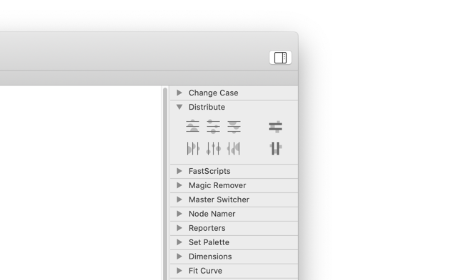

# Distribute

[Glyphs.app](http://glyphsapp.com/) palette for distributing shapes. After installation, it will add a panel called *Distribute* (de: *Verteilen,* fr: *Répartir,* es: *Distribuir,* pt: *Distribuir,* cs: *Rozložit*) to the palette side bar (Cmd-Opt-P).

Hovering over a button will display an explanatory tooltip.

### Installation

1. One-click install *Distribute* from *Window > Plugin Manager > Plugins.*
2. Restart Glyphs.

### Usage Instructions

1. Open a glyph in Edit View.
2. Select three or more shapes to distribute. Partial selection suffices.
3. Press one of the buttons in the *Distribute* palette.

### License

Copyright 2019 Rainer Erich Scheichelbauer (@mekkablue).
Based on sample code by Georg Seifert (@schriftgestalt) and Jan Gerner (@yanone).

Licensed under the Apache License, Version 2.0 (the "License");
you may not use this file except in compliance with the License.
You may obtain a copy of the License at

http://www.apache.org/licenses/LICENSE-2.0

See the License file included in this repository for further details.
